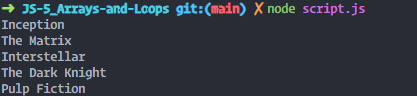

# 🚀 JavaScript Assignment - Array and Loops Challenge 🔁

## Objective

Learn how to use arrays and loops by creating a program that logs a list of your favorite movies to the console.

---

## Provided Files

1. **JavaScript** (`script.js`)  
   A starter file with comments to guide you through the challenge.

2. **HTML** (`index.html`)
   A file to open the console for the desired output

Your task is to complete the **JavaScript** file!

---

## Instructions 🛠️

### Step 1: Open the Project

- Open the provided `script.js` file in your text editor.
- Read through the comments in the file to understand the structure.

### Step 2: Complete the JavaScript

1. Create an array named `favoriteMovies`.
2. Add some movie titles as strings to the `favoriteMovies` array.
3. Use a loop to iterate through the `favoriteMovies` array.
   - Inside the loop, log each movie to the console.  
     Hint: Use the array's `length` property in your loop condition.

---

## Testing Your Program

1. Run the `script.js` file in your browser's developer console or a Node.js environment.
2. Check the console output to ensure all movie titles are logged.
3. Debug your code if it doesn’t work as expected.

### Possible Result

---

### Good luck, and have fun coding! 🎉
