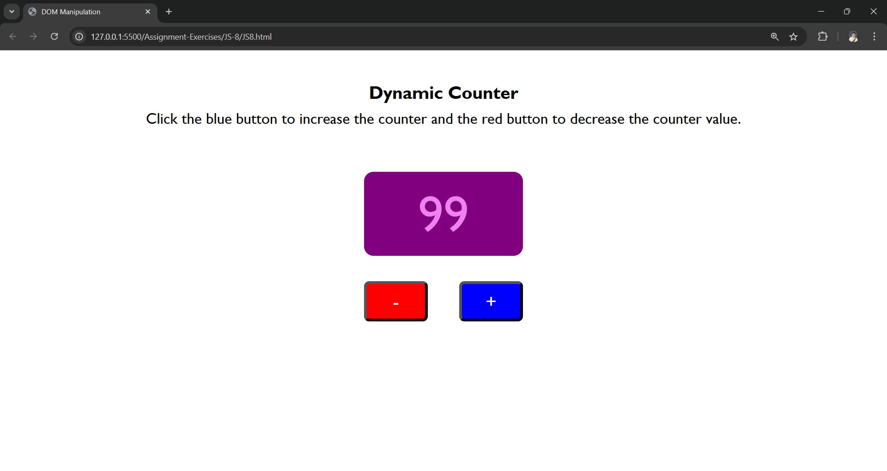

## JS Assignment 8

For the last exercise of this JavaScript study jam, let's practice one of the most important utility in JS, the **DOM Manipulation**.

The **Document Object Model** or DOM is the contents of a webpage represented like a tree of "nodes". These nodes are usually the elements in our webpage which have different relationships depending on how they are arranged in the HTML file.

In this exercise, we will focus on targeting the nodes we need using id selector ("#id" for example), and the DOM method **querySelector** to affect/manipulate certain elements in our the DOM. There's also event handling needed, which you should've already practiced in the previous exercise.

Given the `JS8.html` with ids for counter text, the add button, and the subtract button, you are tasked to edit the `JS8.js` such that when the add (blue) button is clicked, the value of the counter displayed will increase, and the opposite for the subtract (red) button. You can also use the things you learned in JS conditionals to make it so the counter value will not go negative when the subtract button is clicked when it is already zero.

### Self-Check
You can use these pointers to check your work, but it's not necessary to adapt all of them but only get relative close to the possible output.

- Used `document.querySelector("#id-name)` to target the counter text and the button nodes. 
- Used variables to store the targeted nodes.
- Initialized a variable for like "counterVal" as 0 to track current counter value.
- Attached event listeners to the buttons where the counter variable was incremented/decremented appropriately.
- Used `.textcontent` method to the targeted counter text variable to update counter display in the webpage.