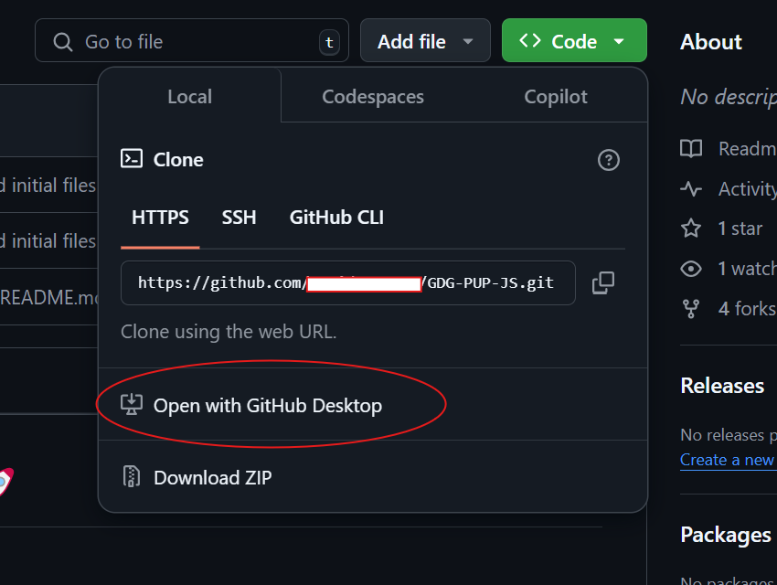

# 🧑🏻‍💻 JavaScript Study Jam 🚀

Welcome to the **JavaScript Workshop** hosted by GDG-PUP Web Development!

Get ready to dive deep into JavaScript fundamentals and hands-on projects. Whether you're new to programming or sharpening your skills, this study jam will help you get comfortable with JavaScript and equip you with the tools to build interactive web applications.

### 👀 What's Inside It

This repository contains the following **main** folders:

1. **Assignments folder**: A collection of exercises designed to solidify your understanding of JavaScript concepts.
2. **Project folder**: The main project that you will build as part of this workshop.

## 📅 Assignments

###  JavaScript Assignments

| No. | Topic                                 | Description |
| --- | ------------------------------------- | ----------- |
| 1   | Introduction to Variables and Types  | Create variables using `let`, `const`, and `var` and print their values. Practice different data types: strings, numbers, booleans, and arrays. |
| 2   | Functions and Scope                  | Write a simple function to return the square of a number. Explore function parameters, return values, and scope (global vs local). |
| 3   | Conditional Statements (If-Else)     | Build a simple age-checking application using `if-else` statements to categorize users as a child, teenager, or adult based on their age. |
| 4   | Loops (For and While)                | Use a `for` loop to print numbers 1 to 10. Then, use a `while` loop to print 10 of your hobbies. |
| 5   | Arrays and Loops                     | Write a program that iterates through an array of your favorite movies and logs each one to the console. |
| 6   | Objects and Methods                  | Create an object representing a "car" with properties like make, model, and year. Write a method to return a description of the car. |
| 7   | Event Handling                       | Create a button that, when clicked, changes the background color of the page. Learn about `addEventListener` and how events work in JavaScript. |
| 8   | DOM Manipulation                     | Create a dynamic counter that increases and decreases a number every time the user clicks on a button. Display the current value of the counter. |

## 🚀 Project Assignment: Rock Paper Scissors Game

Now, it's time to bring everything together with your **JavaScript Project**! Build a **Rock, Paper, Scissors** game where the user can select one of the three options, and the computer randomly selects one as well. The game should:
- Display the user's choice and the computer's choice.
- Display the result (win, lose, or draw).
- Keep track of the score (number of wins, losses, and ties).
- Include a button to reset the game.

### Skills Practice
Throughout this study jam, focus on building your problem-solving skills and your ability to break down tasks into manageable steps. As you go through the assignments, take time to experiment and explore the code on your own. This is your opportunity to strengthen your understanding of JavaScript and become more comfortable with coding in a real-world context.

## 🌟 Getting Started with GDG-PUP Repository Template
Follow these steps to set up your own repository using the GDG-PUP template, complete with an existing directory structure and files to participate in HTML & CSS workshop.

1. Access the Template:
- Go to the main page of the GDG-PUP repository on GitHub.
- Click on the **Use this template** button.

2. Name and Visibility:

- Name the new repository following the format GDG-PUP-HTML-AND-CSS 
- Ensure it is set to public.

2. Create the Repository:

- Click Create repository on the lower right to generate it in your GitHub account.

NOTE: Name it in the GDG-PUP-JS format to ensure consistency.

3. Clone the Repository:

- Go to the repository’s main page, click on the Code button, and choose Open with GitHub Desktop to launch it in GitHub Desktop.

4. Complete the Clone:

In GitHub Desktop, click Clone to download the repository to your local machine.

---
## Submission
- For submission, an assignment in Google Classroom will be provided where you can upload the necessary requirements for this workshop. Please check Google Classroom for further details and deadlines for each assignment.

## 🎉 Happy Coding! 
We’re excited to see your creativity and dedication shine through this project. Let’s make this an amazing learning experience together. Remember, every line of code you write brings you one step closer to mastering wev development. Good luck, and enjoy the journey! 🚀💻
